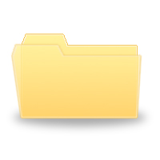

# underscores_tuts
You Tube series by TopTal on learning underscore.js
Each lesson# (video) is an html file with script calling underscore functions.

### Lesson01 - _.first, _.initial, _.last, _.rest
### Lesson02 - _.compact, _.flatten
### Lesson03 - _.without,  _.union, _.intersection, _.difference
### Lesson04 - _.uniq
### Lesson05 - _.zip, _.object, _.range
### Lesson06 - _.indexOf,  _.lastIndexOf, _.sortedIndex
### Lesson07 - _.map
### Lesson08 - _.reduce
### Lesson09 - _.find, _.filter
### Lesson10 - _.contains