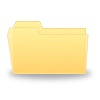

# underscores_tuts
You Tube series on learning underscores. Each lesson# (video) is an html file with script calling underscore functions.

### Lesson01 - _.first, _.initial, _.last, _.rest
### Lesson02 - _.compact, _.flatten